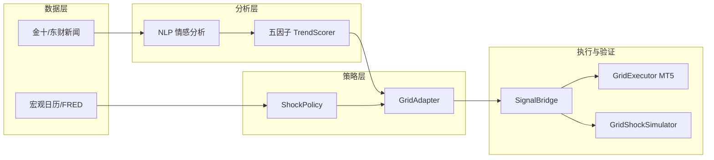

# 第 3 章 系统总体设计

> **对应代码：** `E:\gold-news-system\src\`  
> **配置：** `config/config.yaml`

---

## 3.1 设计目标

系统需实现以下目标：

1. **实时性：** 分钟级轮询新闻源，生成可执行信号 JSON。  
2. **一致性：** 实时 pipeline 与历史回测共用 L1–L4 与方向解析语义。  
3. **可验证性：** 支持 Baseline vs News Adapter 的 A/B 回测及 MT5 模拟盘对照。  
4. **可配置性：** 间距、层数、点差、动量阈值等集中于 YAML，便于实验复现。

---

## 3.2 总体架构

系统分为 **数据层、分析层、策略层、执行层、验证层** 五部分，数据流如下：

**图3-1 系统总体架构示意图**

---

## 3.3 模块划分（Phase 0–4）

| 阶段 | 模块 | 路径 | 功能 |
|------|------|------|------|
| Phase 0 | 数据管道 | `src/paths.py`, `scripts/sync_to_parquet.py` | JSON→Parquet，对接量化项目目录 |
| Phase 1 | 新闻抓取 | `src/news_fetcher/` | 金十、东财轮询 |
| Phase 1 | NLP | `src/nlp_engine/` | 词典 / DeepSeek 情感 |
| Phase 2 | 趋势评分 | `src/trend_scorer/trend_scorer.py` | 五因子 → L1–L4 |
| Phase 2 | 网格适配 | `src/strategy_adapter/grid_adapter.py` | 输出 spacing、停单等建议 |
| Phase 3 | MT5 | `src/mt5_bridge/` | 连接、信号执行、风控 |
| Phase 4 | 回测 | `src/backtest_adapter/` | 信号构建、ShockTimeline、Simulator |

---

## 3.4 数据流与存储

| 数据类型 | 实时缓存 | 归档 |
|----------|----------|------|
| 新闻 | `data/news_cache/*.json` | `02 History Data/news/` |
| 情感/评分 | `data/sentiment_cache/` | Parquet |
| 交易信号 | `data/signals/*.json` | Parquet |
| 历史宏观信号 | — | `historical_signals.parquet` |
| 回测结果 | — | `05 Backtest/results/news-grid/{run_id}/` |

环境变量 `GOLD_DATA_ROOT` 可指向 `E:\量化项目`，便于与既有量化项目目录统一。

---

## 3.5 配置管理

主配置文件 `config/config.yaml`（敏感项不入 Git，模板见 `config.example.yaml`）包含：

- **mt5：** 账号、服务器、品种 GOLD、dry_run / auto_execute  
- **backtest：** leverage、stop_out_margin_level、base_spacing、max_layers、spread_price、timeframe  
- **historical_signals：** surprise 阈值、PCE 排除方向、动量阈值等  

策略参数变更后，通过 `build_historical_signals.py` 与 `run_news_grid_backtest.py` 复现实验。

---

## 3.6 自研回测引擎概要

**GridShockSimulator**（`simulator.py`）在 H1 或 M1 K 线上模拟限价网格成交、TP 平仓、保证金与强平；通过 `ShockTimeline` 注入 news 组冲击规则。详细模型假设与命令见第 5 章。

与外部 golden_shield 等全量引擎的关系：**本毕设以自研引擎验证自有策略**；外部引擎仅作可选对照，非必需依赖。

---

## 3.7 本章小结

本章给出了系统的分层架构、Phase 0–4 模块划分、数据流与配置方案，并概述了回测验证层。第 4 章将详述新闻冲击网格适配策略的规则设计，第 5–6 章分别给出回测实验与 MT5 执行验证。
