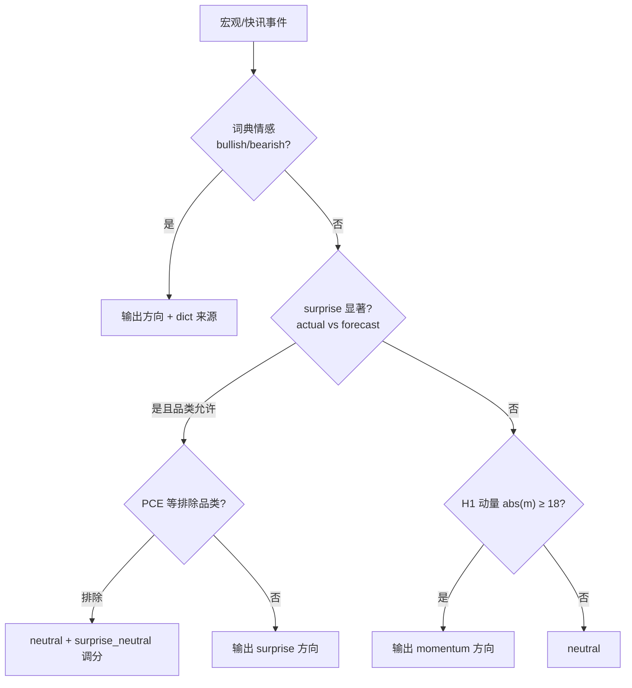

# 第 4 章 新闻冲击网格适配策略

> **说明：** 本章为毕设正文初稿，可直接粘贴进 Word 后按学校格式调整标题层级与图表编号。  
> **对应代码：** `src/strategy_adapter/grid_adapter.py`、`src/backtest_adapter/historical_signals.py`、`src/backtest_adapter/policy.py`

---

## 4.1 策略设计目标

黄金（XAUUSD/GOLD）在宏观数据与地缘事件发布前后，往往在较短时间内出现方向性波动。固定参数的对称网格策略在此类窗口内容易在错误方向持续叠层，小资金高杠杆账户还面临保证金强平风险。本章提出 **新闻冲击网格适配策略（News Shock Grid Adapter）**：在既有对称网格底仓之上，增加一层由新闻事件驱动、按趋势强度分级（L1–L4）的动态防护规则，输出对间距、挂单方向、仓位与持续时间的调整参数，而非替代完整网格选股或趋势模型。

策略设计遵循三条原则：

1. **分级响应**：新闻冲击强度越高，防护动作越强（由 L1 维持至 L4 全面暂停）。  
2. **方向可解释**：优先使用宏观 actual/forecast 意外（surprise），辅以 H1 价格动量；避免黑盒方向。  
3. **与底仓解耦**：底仓为对称限价网格；适配层仅通过 timeline 在事件窗口内修改行为，便于 A/B 对比。

---

## 4.2 趋势强度等级 L1–L4

系统沿用全链路统一的四级分类，与 NLP 评分、GridAdapter 及回测 `ShockPolicy` 一致。各级默认动作由 `LEVEL_ACTIONS` 定义，如表 4-1 所示。

**表 4-1 趋势强度等级与网格适配动作**

| 等级 | 含义 | 暂停反向挂单 | 暂停全部新开 | 间距因子 | 反向仓保留比例 | 最大仓位因子 |
|------|------|:------------:|:------------:|:--------:|:--------------:|:------------:|
| L1 | 弱 | 否 | 否 | 1.0 | 100% | 1.0 |
| L2 | 中等 | **是** | 否 | 0.8 | 0%（仅顺势侧） | 0.8 |
| L3 | 强 | **是** | **是** | 0.6 | 50% | 0.5 |
| L4 | 极强 | **是** | **是** | 0.5 | 0% | 0.3 |

**语义说明：**

- **L1**：低影响事件（如部分就业周边数据），维持现有网格，仅记录信号。  
- **L2**：中等冲击（GDP、零售、部分通胀周边）；停止与判断方向相反的限价挂单，保留顺势侧网格。  
- **L3**：高冲击（NFP、CPI、FOMC 等）；窗口内暂停一切新开仓，并按比例平掉反向持仓。  
- **L4**：极端事件（重大地缘等）；全面暂停挂单，大幅收缩敞口，建议人工或趋势模块接管。

宏观日程默认映射示例：NFP/CPI/FOMC → L3；GDP/零售 → L2；初请失业金 → L1（回测中可配置剔除 weekly claims 以降低噪声）。

**L3 冲击窗口时长：** 回测将 L3 有效防护窗口设为 **4 小时**（`l3_shock_hours=4`），短于日程表上的 24–48 小时日历长度，以避免冲击规则在整个 H1 bar 上过度延长、导致网格长期无法 replenishment。

---

## 4.3 事件方向解析链

历史回测与实时 pipeline 共用同一方向优先级（`historical_signals._resolve_event_direction`），如图 4-1 所示。



### 4.3.1 词典方向（实时路径）

对金十、东财等快讯标题，使用 `gold_sentiment.yaml` 词典或 DeepSeek API 得到 `bullish` / `bearish` / `neutral`。历史宏观回测中词典命中较少（280 条信号中 dict=0），实时 loop 仍保留该层。

### 4.3.2 Surprise 方向（回测主路径）

对含 `actual`、`forecast` 的宏观事件：

1. 计算 `diff = actual - reference`（reference 优先 forecast，否则 previous）。  
2. **显著性检验**（品类阈值）：如 CPI/PCE 环比绝对值 ≥ 0.05%；NFP ≥ 20k；初请 ≥ 5000 等。  
3. **方向映射**（hawkish 数据：高于预期 → 利空黄金）：NFP/CPI/GDP 等「高数值偏 hawkish」；初请「高数值偏 dovish」。  
4. **FRED 数据模式**：CPI/PCE/零售/GDP 使用环比百分比；NFP/初请使用差分。

**PCE 特殊处理：** 评估显示 PCE surprise 方向命中率偏低，策略中将 PCE 降为 **L2**，并列入 `surprise_direction_exclude`：仍参与强度与调分，**不单独决定多空方向**（标记为 `surprise_neutral`）。

### 4.3.3 H1 动量方向（兜底）

在 surprise 不可用时，取事件时点前 H1 动量 `m`；当 `|m| ≥ 18` 时给出 bullish/bearish（`momentum_direction_threshold=18`）。动量与 surprise 冲突时：**surprise 方向不被抹平**，仅下调 composite 分数；非 surprise 来源的方向仍可在强冲突时降为 neutral。

### 4.3.4 价格上下文融合

composite 分数融合新闻强度与动量幅度：`composite = news_mag × (1 - α) + |m| × α`，其中 `α = price_blend = 0.20`。

---

## 4.4 价格动量对冲击参数的微调

在等级动作 `LEVEL_ACTIONS` 确定后，调用 `apply_price_shock_adjustment()`，根据事件时点 H1 动量与新闻方向关系二次微调，如表 4-2。

**表 4-2 价格动量微调规则（|m| 冲突/一致阈值 35）**

| 条件 | 间距因子 | 停单/减仓 | 说明 |
|------|----------|-----------|------|
| 方向 neutral 且 \|m\|>35 | ×1.12 | 保留 L3 停单 | `neutral_widen_only=true` |
| 方向与 m 冲突 | ×1.2 | 取消 pause | 降级冲击，避免错误停单 |
| 方向与 m 一致 | ×0.9 | 略增仓位因子 | 略收紧间距 |

该设计来自回测对比：若在 neutral+L3 场景下因强动量取消 `pause_all_new`，小账户回撤恶化；故采用「只放宽间距、保留停单保护」。

---

## 4.5 方向性网格（Directional Grid）

当 `directional_grid=true` 且在冲击窗口内存在明确 bullish/bearish（L2 及以上）时，回测模拟器 **仅 replenishment 顺势侧限价单**：

- bullish → 只挂 buy 网格；  
- bearish → 只挂 sell 网格。

Baseline 始终为双侧对称网格。该开关使 news 组在宏观窗口内减少「逆势叠层」，与 L2「暂停反向挂单」形成互补。

---

## 4.6 从信号到 ShockPolicy

实时与回测统一通过 `ShockPolicy.from_signal()` 将单条信号转为可执行策略包，字段包括：

- `grid_spacing`、`spacing_factor`  
- `pause_reverse`、`pause_all_new`  
- `reverse_ratio`、`max_positions`、`default_lot`  
- `trend_level`、`direction`、`title`

多条信号窗口重叠时，`ShockTimeline` 按等级取高（`merge_policies`），同等级保留后激活事件。

---

## 4.7 冲击激活时的执行语义

在回测引擎 `GridShockSimulator` 与 MT5 `GridExecutor` 中，每个 `news_id` **首次进入窗口** 时触发一次冲击动作（`apply_shock_on_activate` 语义）：

1. 若 `pause_all_new`：清空全部 pending 限价单。  
2. 若 `pause_reverse`：删除与 direction 相反的 pending。  
3. 若 `reverse_ratio < 1`：按 `(1 - reverse_ratio)` 比例市价平掉反向持仓。  

窗口内每根 K 线另应用 spacing_factor、directional_grid 与 risk overlay，直至窗口结束。

---

## 4.8 策略流程伪代码

```
输入: 事件 e, H1 序列, 配置 cfg
输出: ShockPolicy P

1. (level, duration) ← ClassifyEvent(e.title)
2. category ← EventCategory(e)
3. 若 category ∈ cfg.exclude → 跳过
4. (direction, score, source) ← ResolveDirection(e, H1)
5. base ← LEVEL_ACTIONS[level]
6. base ← ApplyPriceShockAdjustment(base, direction, Momentum(H1, e.time))
7. spacing ← cfg.base_spacing × base.spacing_factor
8. 构造 P(level, direction, spacing, base.pause_*, base.reverse_ratio, ...)
9. 若 level=L3 → duration_shock ← min(duration, cfg.l3_shock_hours)
10. 写入 timeline 窗口 [e.time, e.time + duration_shock)
```

---

## 4.9 本章小结

本章给出了自有策略的核心：**以 L1–L4 分级动作表为骨架，以 surprise→动量方向链为输入，以价格动量微调与方向性网格为增强**，在事件时间窗口内动态改变对称网格的行为。该策略与 NLP、MT5 执行层通过统一 JSON / Parquet 信号格式衔接，下一章在自研回测引擎上对其防护效果进行量化验证。

---

**图号占位（正式排版时插入）：**

- 图 4-1 方向解析流程图（上文 mermaid 可导出）  
- 图 4-2 L1–L4 动作强度示意（表格可视化）  
- 图 4-3 单次 CPI 发布前后 timeline 与 shock 动作时序（可从 `news_shock_events.csv` 选取案例）
